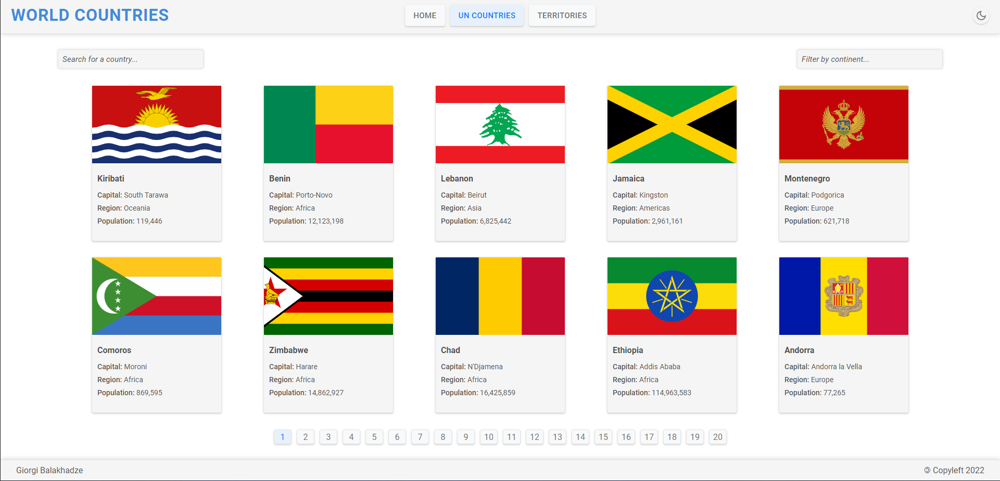
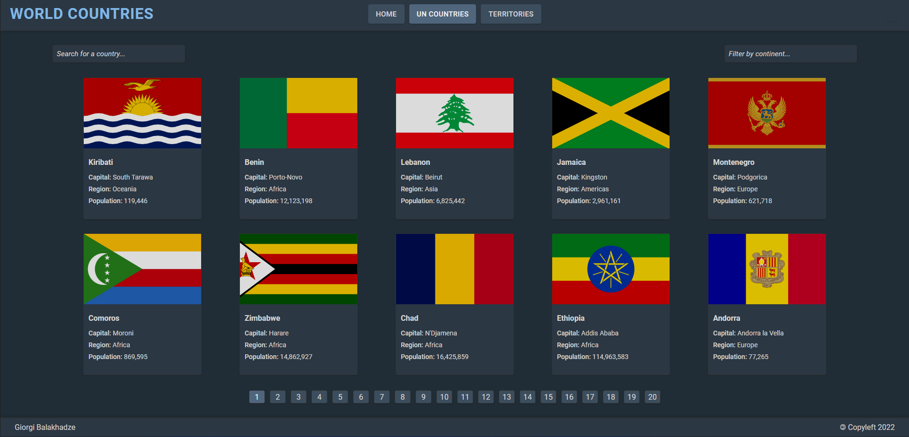

# Frontend Mentor - REST Countries API with color theme switcher solution

## Table of contents

- [Overview](#overview)
  - [The challenge](#the-challenge)
  - [Screenshot](#screenshot)
  - [Links](#links)
- [My process](#my-process)
  - [Built with](#built-with)

## Overview

### The challenge

Users should be able to:

- See all countries from the API on respective pages
- Randomly switch countries on the homepage
- Search for a country using an `input` field
- Filter countries by continent
- Click on a country to see more detailed information on a separate page
- Click through to the border countries on the detail page
- Toggle the color scheme between light and dark mode
- Naviage by using pagination

### Screenshot

### Links

- Live Site URL: [https://gb-worldcountries.netlify.app](https://gb-worldcountries.netlify.app)

## My process

### Built with

- Semantic HTML5 markup
- CSS custom properties
- Flexbox
- Modular JS
- No JS libraries
- Custom routing
- Custom color scheme
- Custom color scheme switcher
- History API
- Storage API
- URL API
- JSON API
- AJAX
